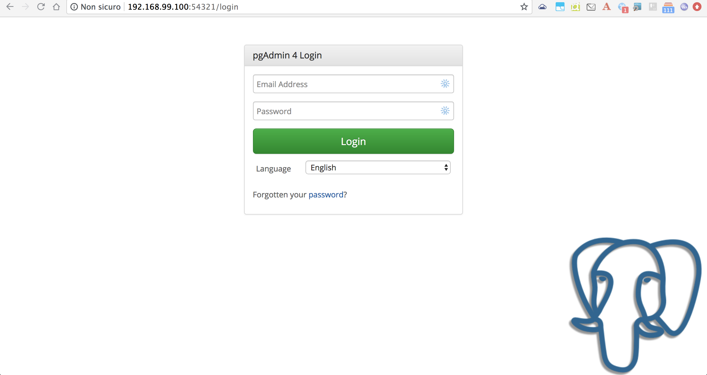
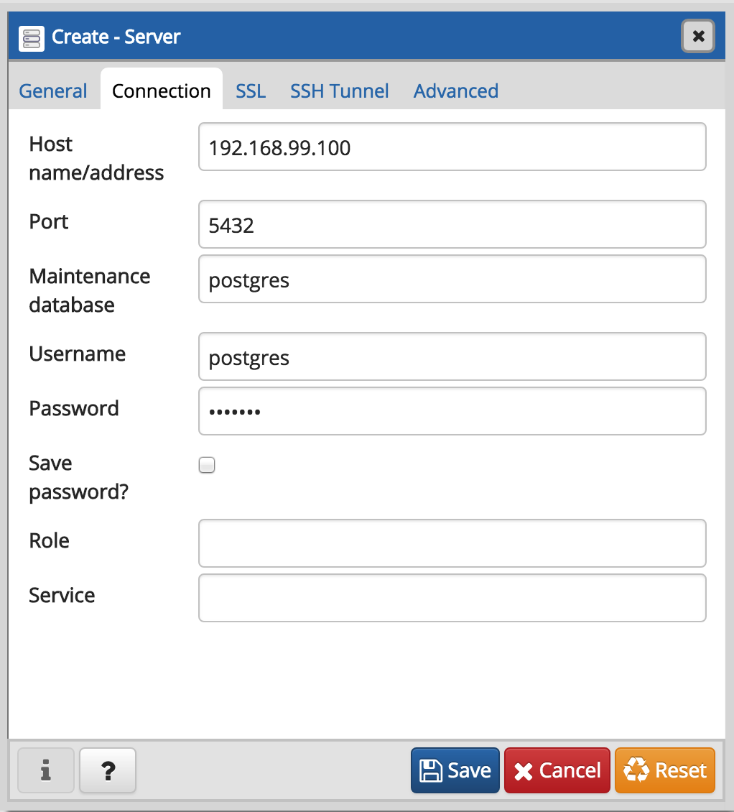
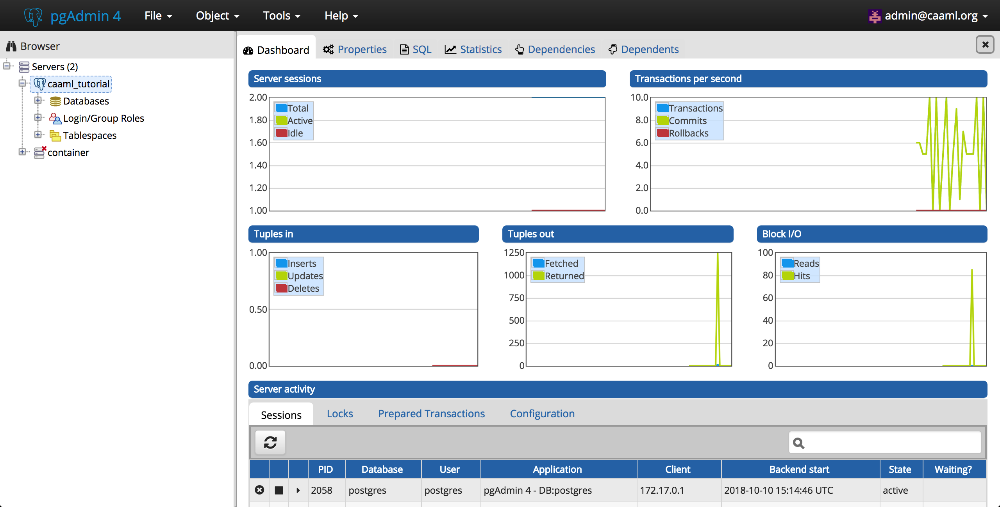

## Start components

For running through the steps of the tutorial It is supposed to have a working Kubernetes cluster which serves web applications from an IP address of your host machine.

At the moment the only component that needs to be deployed outside of the cluster is the GeoAvalanche server which is not yet Docker-ready. We can compile it and deploy into an application container like [Tomcat](https://tomcat.apache.org/).

### Preliminary checks

If you are running [minikube](https://kubernetes.io/docs/setup/minikube/) for a local instance of kubernetes cluster then following these steps:

1. Start minikube

```shell
minikube start
```

2. Check the status

```shell
minikube status
```

the result is something like

```shell
minikube: Running
cluster: Running
kubectl: Correctly Configured: pointing to minikube-vm at 192.168.99.100
```

our host IP address will be `192.168.99.100`

3. Configure the shell for Docker

```shell
eval $(minikube docker-env)
```

### PostGIS

At this point starting an instance of PostGIS is quite simple with a `docker` command and some configuration parameters for it:

```shell
docker run -p 5432:5432 --name caaml-db -e POSTGRES_PASSWORD=geonode -e GEONODE_DATABASE=geonode -e GEONODE_DATABASE_PASSWORD=geonode -e GEONODE_GEODATABASE=caaml_data -e GEONODE_GEODATABASE_PASSWORD=geonode -d geonode/postgis
```

Important notes are:

- The server will be available on port `5432` of the host
- The master use will be `postgres` with password `geonode`
- Our spatial database for CAAML is named `caaml_data`

### PGAdmin4

Let's start also an utility to work with the previously created database `caaml_data`:

```bash
docker run -p 54321:80 --name caaml-pgadmin4 -e PGADMIN_DEFAULT_PASSWORD=geonode -e PGADMIN_DEFAULT_EMAIL=admin@caaml.org -d dpage/pgadmin4
```

Important notes:

- The PGAdmin4 application will be available on port `54321` of the host
- Login to the console can be done with username `admin@caaml.org` and password `geonode`

#### Check the connection

Login to the console:



You can then add a new connection by right-clicking on `Servers`, then choicing `Create` and `Server`:



Fill the connection form with the values for accessing the database and give it a name i.e. `caaml_tutorial` then click the `Save` button.

```bash
# connection parameters
Hostname: 192.168.99.100
Port: 5432
Username: postgres
Password: geonode
```

We should see something similar to this dashboard:

