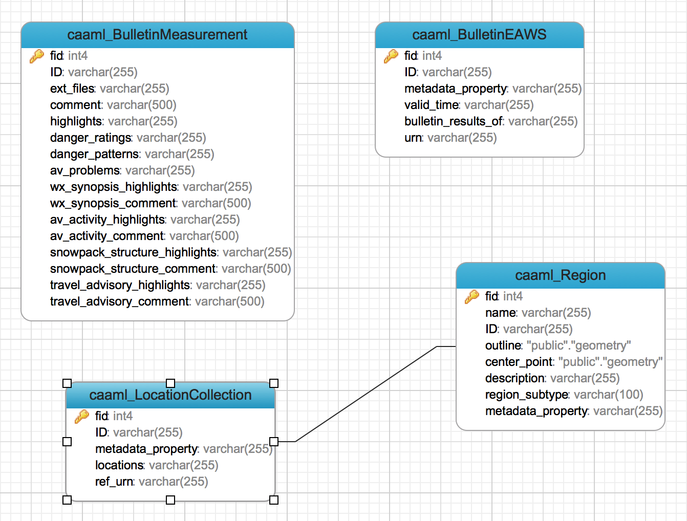

## Design of ER model for EAWS CAAML profile

The model has been drafted and it's still a working progress but for the goal of the tutorial is fairly enough.

The database structure is depicted in the following E/R diagram:



There are four normalized tables:

* **caaml_Region**: has basic information about the snow meteorological zone where at least measurements and bulletins insist but in general is the base building block for any CAAML object which has a spatial property (location)
* **caaml_LocationCollection**: this table refers to collections where each record is made of multiple regions
* **caaml_BulletinEAWS**: each record of this table stores all the information regarding a bulletin for a location such has metadata, period of time for its validity and nested information about the measurements for it
* **caaml_BulletinMeasurement**: holds all the measurements that were taken for a bulletin

A one-to-many relationship exists between *caaml_LocationCollection* and *caaml_Region*

For now we will consider just the trivial case of the table **caaml_Region** about regions for exchanging the following CAAML element

```xml
<element name="Region" type="caaml:RegionType"/>
```