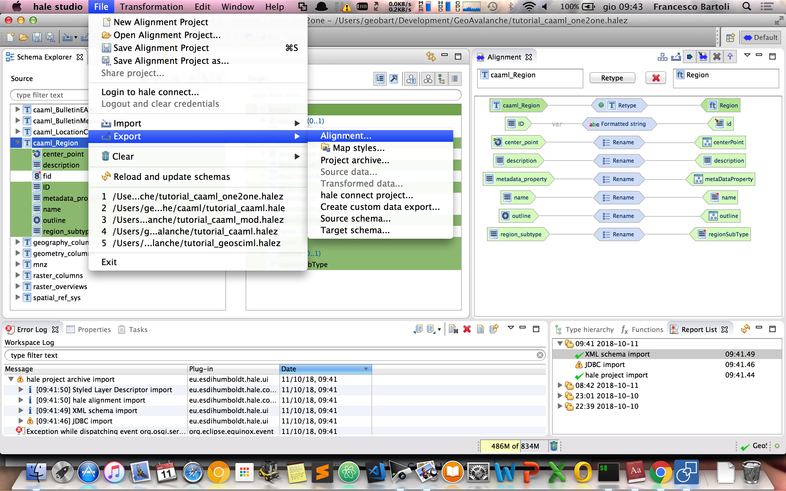

## Export the CAAML application schema configuration

At the end of the mapping session we should have completed all the mapping properties for our **Region** target type and the Hale window should look like:

Assuming we have our instance of GeoAvalanche running locally at `http://localhost:8080/geoavalanche` let's see how simple is to get CAAML features published from that server:

From the `File` menu select `Export` and then click on `Alignment`:

Select `App-Schema Configuration [Direct Upload]` then click `Next`

Fill the `Target URL` with the base url for your server `http://localhost:8080/geoavalanche` and then click `Next`

Tick the option to include your custom target schema until it's not published online and then click `Next`

Double check your workspace configuration and then click `Next`

Fill the values for the **PostGIS** datastore connection parameters and then click `Next`

Fill the values for the administration of **GeoAvalanche** server. By default they are set up to `admin/geoserver`

Then click `Finish` and wait for the completion of the upload. Once finished you can close **Hale** and play with the **Region** features

Visit the `Layer Preview` page of GeoAvalanche and you should see a new layer in the list which is named `caaml:Region`:

We have just successfully created a new app-schema datastore in GeoAvalanche. Let's see now how we can query our regions.