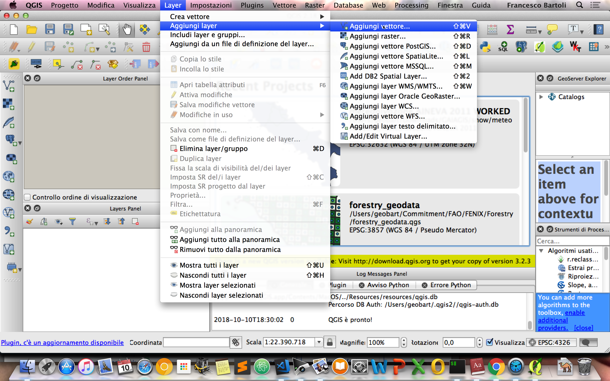
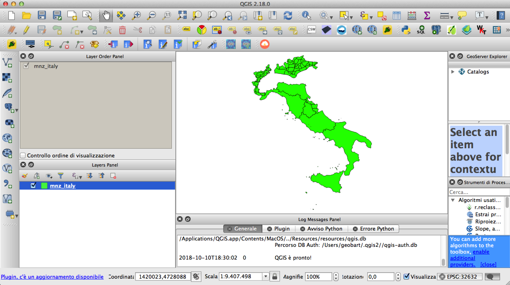
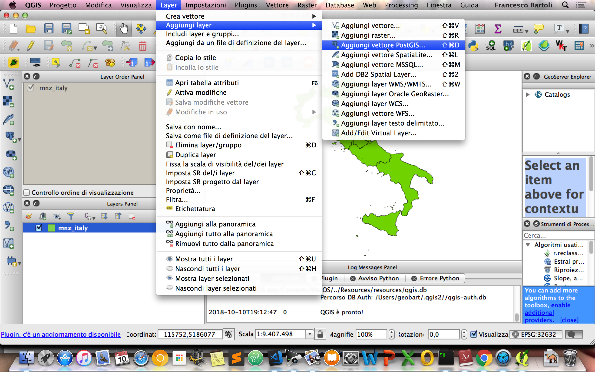
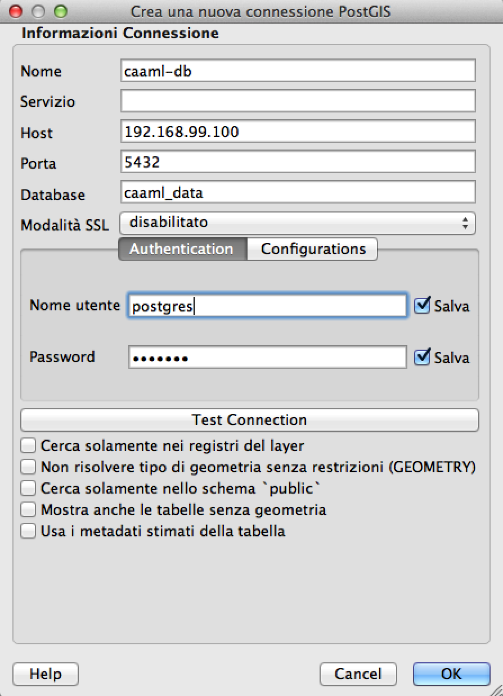
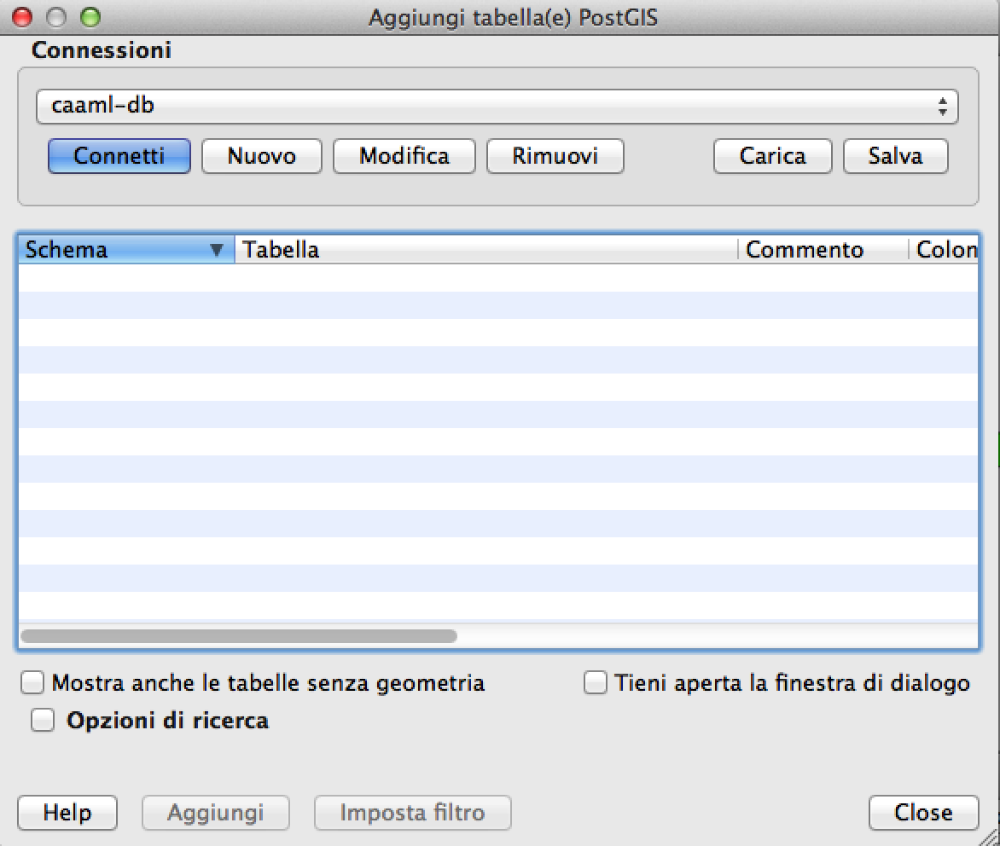
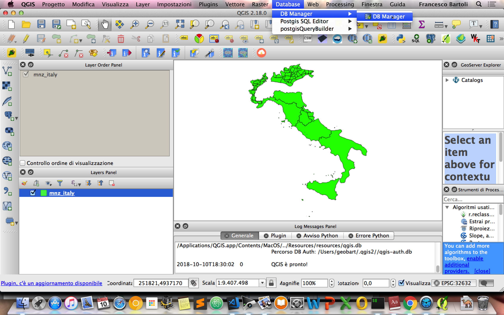
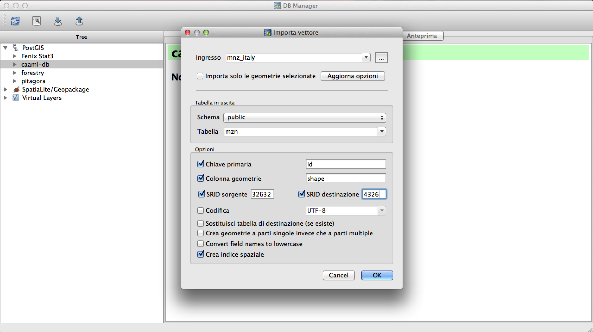

## Load the shapefile into PostGIS

The first thing to do is to add the dataset `mnz_italy` to our PostGIS database `caaml_data`. QGIS is the quick way to go. Let's go through the screenshot below after having extracted the shapefile from the archive in the folder `data`.

#### Add the shapefile to QGIS

We should see something like this:

#### Create a new PostGIS connection for caaml_data

Click on `new` for create a new connection

Fill the fields with the same connection parameters used for **PGAdmin4**

Click `ok` and then `connect`.

#### Load the shapefile into the connected schema

then click the down arrow icon and fill the fields with the preferences on how the shapefile has to be imported into a PostGIS table.

Important notes:

- The name of the final table `mzn`
- The name of the geometry column `shape`
- The reprojection from the source SRID `EPSG:32632` to `EPSG:4326` with geographic coordinates
- The setting to create a spatial index for the geometry column