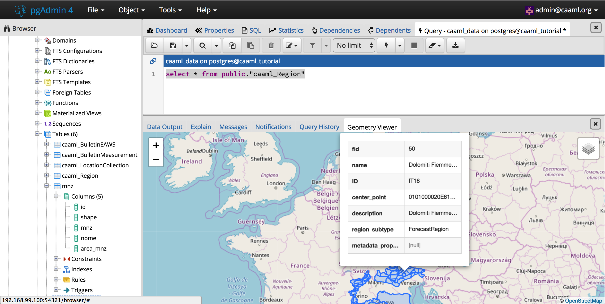
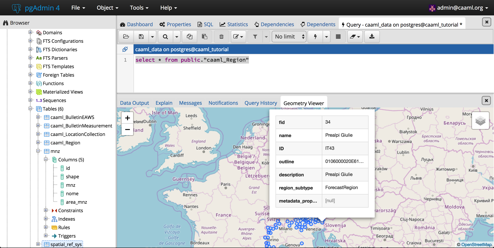

## Import the records to the caaml_Region table

Given that the schema for a region is defined with a polygon and its center point we are going to use the power of PostGIS spatial functions to create it.

The query to populate the table for the Italian regions from Aineva is the following:

```sql
INSERT into public."caaml_Region"(fid, "name", "ID", outline, center_point, "description")
SELECT id, nome, mnz, shape, ST_centroid(shape), nome from public.mnz
# update region_subtype
UPDATE public."caaml_Region" SET region_subtype = 'ForecastRegion'
```

We have also updated the field region_subtype with the value `ForecastRegion` which seems to be the default used from EAWS.

## Visualize the resultset from PGAdmin4

The tool PGAdmin4 has embedded a geometry visualizer which can be used to have a quick preview of the layer on a map.

Let's run the trivial query for the whole

```sql
select * from public."caaml_Region"
```

and then click on the eye icon of both the geometry columns

outline
---


center_point
---

